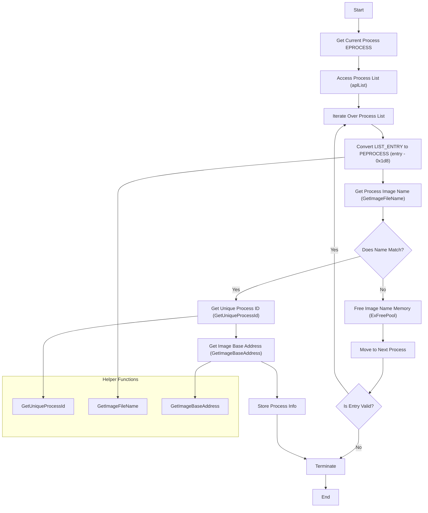

# About the proyect
This is not a finished project, but rather a test code developed for experimentation and learning purposes. It is designed to explore and understand kernel-level concepts and Windows process structures, also a bit of ioctl communicating with user space
# What do I need to know ?
- C/C++ [UserMode](https://learn.microsoft.com/en-us/cpp/?view=msvc-170) [KernelMode](https://learn.microsoft.com/en-us/windows-hardware/drivers/)
- How Memory works
- [Windows Process Structures](https://www.vergiliusproject.com/)
# Documentation
In the documentation, we will focus on **WDM_BASE**. The most important function of the project is **ProcessInfoByName**, located in **proc.c**. This function is responsible for referencing the `EPROCESS` structure of the process where the driver is loaded. Once at position `0x0` of the referenced structure, I need to add the necessary number of bytes to reach the next list member. Once at that member, we must dereference the memory to obtain the data we are looking for.

