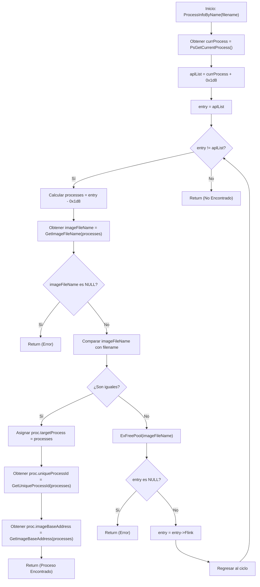

# Sobre el Proyecto

Este no es un proyecto terminado, sino un código de prueba desarrollado con fines de experimentación y aprendizaje. Está diseñado para explorar y entender conceptos de kernel y estructuras de procesos de Windows, además de trabajar un poco con ioctl para comunicar el espacio de usuario con el kernel.

# Qué necesito saber?

- C/C++ [Modo Usuario](https://learn.microsoft.com/en-us/cpp/?view=msvc-170) [Modo kernel](https://learn.microsoft.com/en-us/windows-hardware/drivers/)
- Cómo funciona la memoria
- [Estructuras de Procesos de Windows](https://www.vergiliusproject.com/)

# Documentación

**En esta documentación, nos centraremos en el **WDM_BASE**. El propósito principal de este proyecto es proporcionar información crítica sobre un proceso específico, interactuando con los miembros de la estructura `EPROCESS`. La función clave en el proyecto es **ProcessInfoByName**, ubicada en **process.c**.**

Esta función es responsable de recuperar información sobre un proceso haciendo referencia a su estructura `EPROCESS`, que está cargada en el núcleo. El primer paso es iterar sobre los procesos utilizando el miembro `ActiveProcessLinks`, lo que permite acceder a la lista de procesos activos.

Una vez que la función encuentra el proceso objetivo, interactúa con otros miembros de la estructura, como el `PEB` (Process Environment Block), para obtener datos adicionales que no están disponibles directamente en el `EPROCESS`. Este proceso proporciona información detallada sobre el proceso objetivo, como su `UniqueProcessId`, el nombre del archivo de imagen y la dirección base de la imagen.

