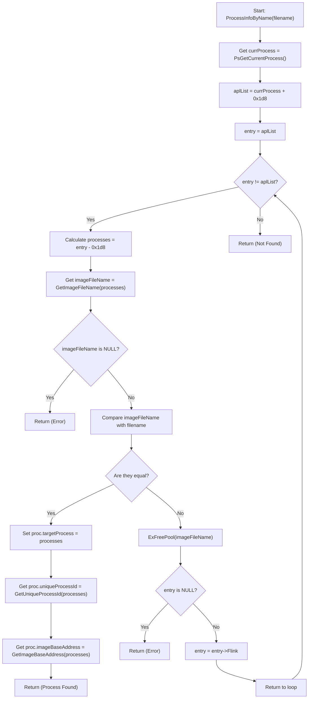

# About the proyect
This is not a finished project, but rather a test code developed for experimentation and learning purposes. It is designed to explore and understand kernel-level concepts and Windows process structures, also a bit of ioctl communicating with user space
# What do I need to know?
- C/C++ [UserMode](https://learn.microsoft.com/en-us/cpp/?view=msvc-170) [KernelMode](https://learn.microsoft.com/en-us/windows-hardware/drivers/)
- How Memory works
- [Windows Process Structures](https://www.vergiliusproject.com/)
# Documentation
**In this documentation, we will focus on the **WDM_BASE**. The main purpose of this project is to provide critical information about a specific process by interacting with the members of the `EPROCESS` structure. The key function in the project is **ProcessInfoByName**, located in [process.c](https://github.com/lucasbuyatti/BASE/blob/master/WDM_BASE/src/proc/process.c).
This function is responsible for retrieving information about a process by referencing its `EPROCESS` structure, which is loaded into the kernel. The first step is to iterate over the processes using the `ActiveProcessLinks` member, which allows accessing the list of active processes.
Once the function finds the target process, it interacts with other structure members, such as `PEB` (Process Environment Block), to gather additional data that is not available directly in the `EPROCESS`. This process provides detailed information about the target process, such as its `UniqueProcessId`, image file name and image base address.




# Making the kernel code functional
- Follow steps 1 to 3 from [Microsoft's guide](https://learn.microsoft.com/en-us/windows-hardware/drivers/download-the-wdk)
- Install [VirtualBox](https://www.virtualbox.org/)
- Install [WinDbg](https://learn.microsoft.com/en-us/windows-hardware/drivers/debugger/) on the host computer
- Download and install [Windows 11 ISO](https://www.microsoft.com/es-es/software-download/windows11) in VirtualBox
- Set up the virtual environment in VirtualBox
- Configure WinDbg
- Clone this repository
- Update the [structs](https://github.com/lucasbuyatti/BASE/blob/master/WDM_BASE/src/global/struct.h) and [hex code](https://github.com/lucasbuyatti/BASE/blob/master/WDM_BASE/src/global/struct.h) according to your Windows version
- Compile the code
- Run the following commands in the virtual machine's **CMD**:  
```shell
bcdedit /set testsigning on  
bcdedit /set nointegritychecks on
```
 - Create a **.bat** with this: <br>
 **Create and start the driver**
```sh
@echo off
echo Installing and starting the driver...

:: Create service
sc create MyDriver binPath= C:\path\to\driver.sys type= kernel start= demand

:: Start Service
sc start MyDriver

echo Driver installed and started successfully.
pause
```
 **Stop and delete the driver**
```sh
@echo off
echo Stopping and deleting the driver...

:: Stop the driver service
sc stop MyDriver

:: Delete the driver service
sc delete MyDriver

echo Driver stopped and deleted successfully.
pause
```

[Demostration - no setup, just results](https://www.youtube.com/watch?v=k0MPm7E27Cw)

