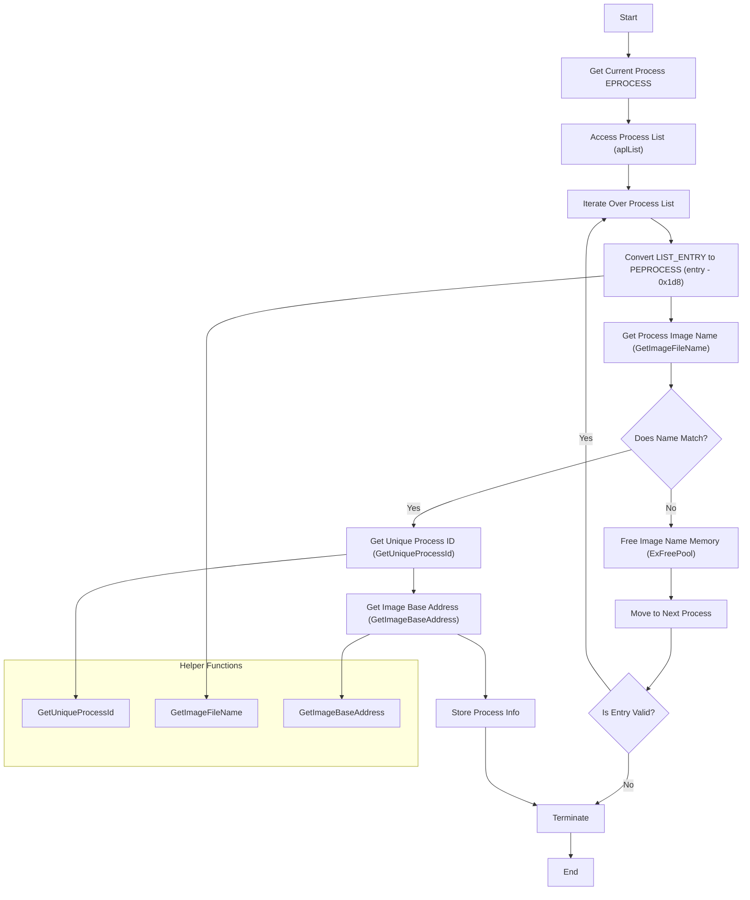

# About the proyect (EN)
This is not a finished project, but rather a test code developed for experimentation and learning purposes. It is designed to explore and understand kernel-level concepts and Windows process structures, also a bit of ioctl communicating with user space
# What do I need to know ?
- C/C++ [UserMode](https://learn.microsoft.com/en-us/cpp/?view=msvc-170) [KernelMode](https://learn.microsoft.com/en-us/windows-hardware/drivers/)
- How Memory works
- [Windows Process Structures](https://www.vergiliusproject.com/)
# Documentation
**In this documentation, we will focus on the **WDM_BASE**. The main purpose of this project is to provide critical information about a specific process by interacting with the members of the `EPROCESS` structure. The key function in the project is **ProcessInfoByName**, located in **process.c**.**
This function is responsible for retrieving information about a process by referencing its `EPROCESS` structure, which is loaded into the kernel. The first step is to iterate over the processes using the `ActiveProcessLinks` member, which allows accessing the list of active processes.
Once the function finds the target process, it interacts with other structure members, such as `PEB` (Process Environment Block), to gather additional data that is not available directly in the `EPROCESS`. This process provides detailed information about the target process, such as its `UniqueProcessId`, image file name and image base address.

